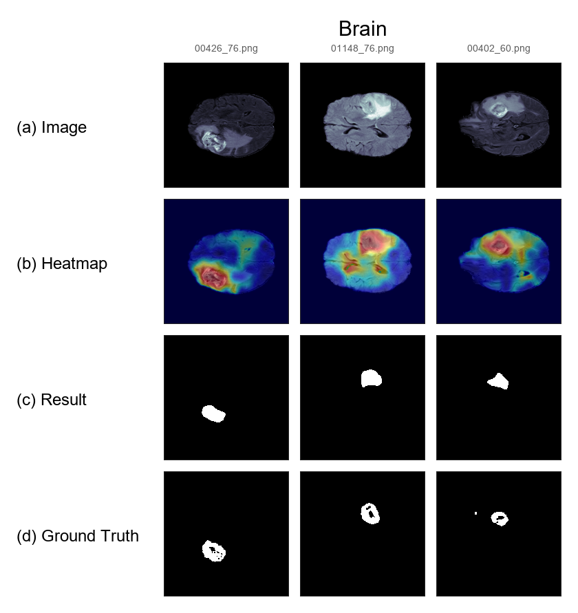
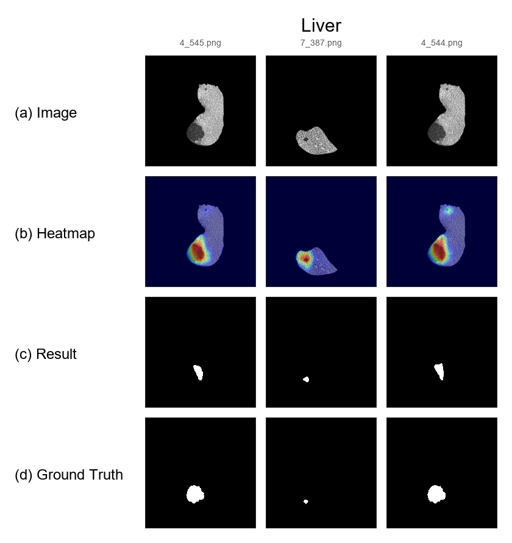
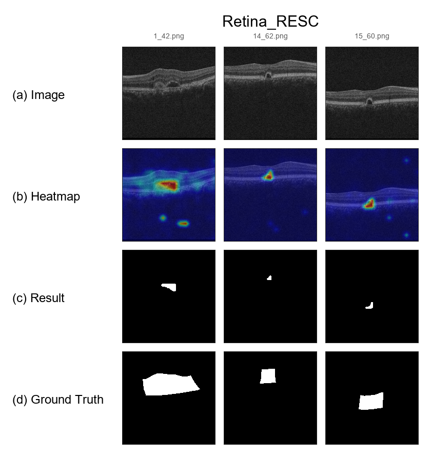
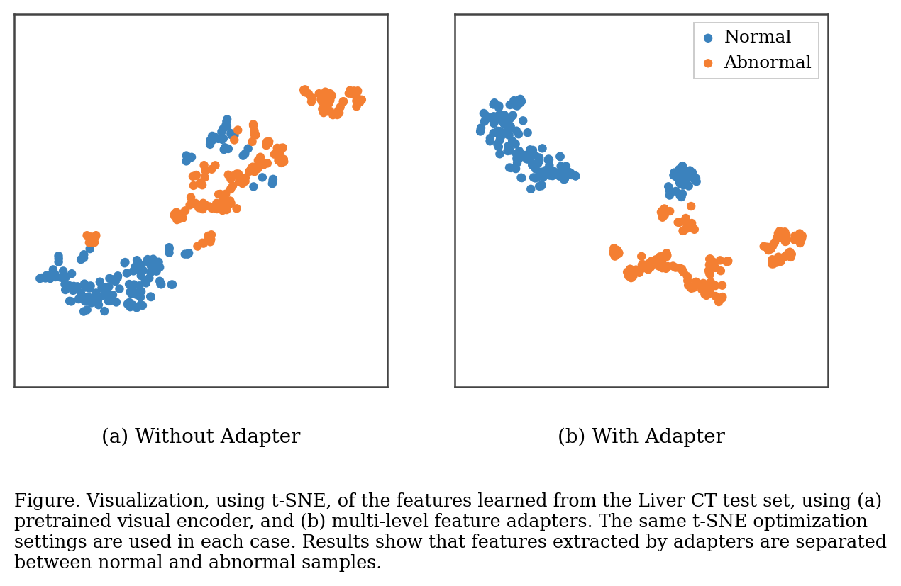

# Localization-Only Medical Anomaly Detection

This repository contains a localization-focused derivative of `MVFA-AD` for three target datasets: `Brain`, `Liver`, and `Retina_RESC`.

Current scope:

- task: localization only
- backbone: frozen CLIP ViT-L/14@336
- branch design: single segmentation branch
- adapter layers: `[12, 24]`
- adapter type: `spatial_text_guided`

## Upstream Origin

This codebase is derived from the original `MVFA-AD` project from `MediaBrain-SJTU` and keeps the upstream MIT license in [LICENSE](LICENSE). The repository has been simplified around a single localization-only training and evaluation path.

- Original repository: https://github.com/MediaBrain-SJTU/MVFA-AD
- Original paper: https://arxiv.org/abs/2403.12570

## Get Started

### Environment

- python >= 3.8
- pytorch >= 1.10
- torchvision
- numpy
- scikit-learn
- pillow
- tqdm
- ftfy
- regex

### Pretrained Weights

- CLIP ViT-L/14@336:
  https://openaipublic.azureedge.net/clip/models/3035c92b350959924f9f00213499208652fc7ea050643e8b385c2dac08641f02/ViT-L-14-336px.pt

Download the CLIP checkpoint and place it under `CLIP/ckpt/`:

```text
CLIP/ckpt/ViT-L-14-336px.pt
```

Localization checkpoints produced by this repository are stored under `ckpt/localization/`. Local checkpoints are intentionally ignored by Git and should be managed outside the repository history.

### Data Preparation

This repository follows the same setup idea as the original `MVFA-AD` `Get Started` section: download or prepare the benchmark separately, then place the extracted folders under `data/`.

- Optional benchmark access workflow: https://github.com/DorisBao/BMAD
- Pre-processed benchmark links referenced by the original `MVFA-AD` README:
  - Brain: https://drive.google.com/file/d/1YxcjcQqsPdkDO0rqIVHR5IJbqS9EIyoK/view?usp=sharing
  - Liver: https://drive.google.com/file/d/1xriF0uiwrgoPh01N6GlzE5zPi_OIJG1I/view?usp=sharing
  - RESC: https://drive.google.com/file/d/1BqDbK-7OP5fUha5zvS2XIQl-_t8jhTpX/view?usp=sharing

After downloading, place the extracted datasets under `data/`:

```text
data/
|- Brain_AD/
|  |- valid/
|  `- test/
|- Liver_AD/
|  |- valid/
|  `- test/
`- Retina_RESC_AD/
   |- valid/
   `- test/
```

See [data/README.md](data/README.md) for the dataset-specific notes.

Active data protocol:

- source training split: `valid`
- target validation split during training: `valid`
- target final evaluation split: `test`

### File Layout

```text
MVFA-AD/
|- CLIP/
|  |- ckpt/
|  |  `- ViT-L-14-336px.pt
|  |- clip.py
|  |- localization_adapter.py
|  |- model.py
|  |- model_configs/
|  |- openai.py
|  `- tokenizer.py
|- ckpt/
|  |- __init__.py
|  `- localization/
|- data/
|  |- Brain_AD/
|  |- Liver_AD/
|  `- Retina_RESC_AD/
|- dataset/
|  `- medical_localization.py
|- prompt.py
|- test_zero.py
|- train_zero.py
|- utils.py
`- visualize_zero.py
```

## Key Files

- `train_zero.py`: localization-only training entrypoint
- `test_zero.py`: localization-only evaluation entrypoint
- `visualize_zero.py`: qualitative visualization entrypoint
- `CLIP/localization_adapter.py`: single-branch two-layer spatial text-guided adapter
- `dataset/medical_localization.py`: localization-only source and target datasets
- `prompt.py`: prompt ensemble definitions
- `utils.py`: text encoding and layer fusion helpers

## Train

Train the localization-only model for `Brain`:

```bash
python train_zero.py --obj Brain
```

By default training uses `--prompt_mode upstream`, which mirrors the prompt ensemble style used in the upstream `MediaBrain-SJTU/MVFA-AD` repository.

Train for `Liver`:

```bash
python train_zero.py --obj Liver
```

Train for `Retina_RESC`:

```bash
python train_zero.py --obj Retina_RESC
```

## Test

Evaluate the saved checkpoint for `Brain`:

```bash
python test_zero.py --obj Brain
```

Evaluation defaults to `--prompt_mode auto`: if the checkpoint stores `prompt_mode=upstream` it reuses that mode, otherwise it falls back to `upstream`.

Evaluate for `Liver`:

```bash
python test_zero.py --obj Liver
```

Evaluate for `Retina_RESC`:

```bash
python test_zero.py --obj Retina_RESC
```

## Results

Localization `pAUC` results on the three target datasets:

| Target | layer12 only | layer24 only | 12+24 equal fusion | 12+24 learned fusion |
| --- | ---: | ---: | ---: | ---: |
| Brain | 0.9342 | 0.9229 | **0.9378** | **0.9378** |
| Liver | 0.9743 | 0.9773 | **0.9882** | **0.9882** |
| Retina_RESC | 0.8769 | 0.8349 | **0.8938** | 0.8935 |
| Average | 0.9285 | 0.9117 | **0.9399** | 0.9398 |

These numbers summarize the localization-only ablation over different CLIP feature fusion settings, with `12+24 equal fusion` giving the best average `pAUC`.

## Visualization

Representative localization results for each target dataset:

<table>
  <tr>
    <td align="center"><b>Brain MRI</b></td>
    <td align="center"><b>Liver CT</b></td>
    <td align="center"><b>Retina RESC</b></td>
  </tr>
  <tr>
    <td align="center"></td>
    <td align="center"></td>
    <td align="center"></td>
  </tr>
</table>

Each panel shows the original image, heatmap, thresholded prediction mask, and ground-truth anomaly mask for representative abnormal samples.

## Feature Distribution

Visualization, using t-SNE, of the features learned from the Liver CT test set, using (a) pretrained visual encoder, and (b) multi-level feature adapters.



The same t-SNE optimization settings are used in each case. Results show that features extracted by adapters are separated between normal and abnormal samples.

## Generate Visualizations

Generate a localization visualization panel for `Brain`:

```bash
python visualize_zero.py --obj Brain --num_samples 3 --output ./images/brain_localization_visualize.png
```

Generate a multi-dataset panel after training all required targets:

```bash
python visualize_zero.py --obj Brain Liver Retina_RESC --num_samples 3 --output ./images/localization_visualize.png
```

Generate the Liver t-SNE comparison figure:

```bash
python tsne_zero.py --obj Liver --split test --selection_mode confidence --feature_mode pooled --samples_per_class 150 --perplexity 25 --output ./images/liver_tsne_paper.png
```

Useful options:

- `--start_index`: skip the first abnormal samples and start later in the sorted test list
- `--threshold`: threshold for turning the heatmap into a binary `Result`
- `--display_size`: output tile size for each panel cell
- `--prompt_mode`: choose `upstream`; evaluation scripts also support `auto`
- `--samples_per_class`: number of normal and abnormal samples used in the t-SNE figure
- `--selection_mode`: `random` for unbiased balanced sampling, `confidence` for a clearer representative subset
- `--feature_mode`: `patch` for mean-pooled adapter patch tokens, `pooled` for final global image features

The visualization script renders four rows per sample:

- original image
- heatmap overlay
- thresholded prediction mask
- ground-truth anomaly mask

## Notes

- Local datasets, pretrained weights, checkpoints, and cache files are ignored by Git for easier publishing.
- This code path no longer includes the original image-level anomaly detection branch.
- The active metric is pixel-level localization `pAUC`.
- The adapter configuration is fixed to `spatial_text_guided` with layers `[12, 24]`.
- Image inputs are normalized with CLIP `image_mean/image_std`.
- Prompt modes:
- `upstream` matches the prompt ensemble used by the upstream repository, including the `REAL_NAME` mapping for classes such as `Retina_RESC -> retinal OCT`.

## Citation

If the upstream MVFA-AD method is helpful for your work, please cite the original paper:

```bibtex
@inproceedings{huang2024adapting,
  title={Adapting Visual-Language Models for Generalizable Anomaly Detection in Medical Images},
  author={Huang, Chaoqin and Jiang, Aofan and Feng, Jinghao and Zhang, Ya and Wang, Xinchao and Wang, Yanfeng},
  booktitle={IEEE/CVF Conference on Computer Vision and Pattern Recognition (CVPR)},
  year={2024}
}
```

## Acknowledgement

This repository is derived from `MediaBrain-SJTU/MVFA-AD` and also includes CLIP-related code adapted from OpenAI. Please keep the upstream license and attribution notices when redistributing derivative versions.
